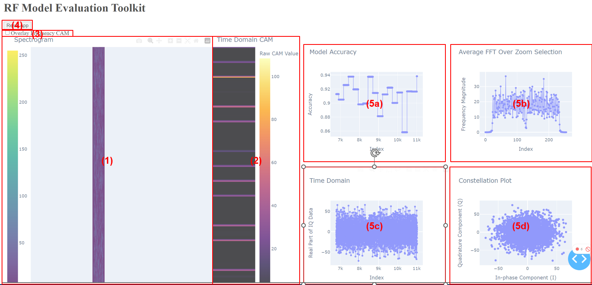

# README for RF-Models-CAM-Evaluation (DRAFT)

This README provides updated instructions and information for the RF-Models-CAM-Evaluation GitHub repository, focusing on Score-CAM implementation for 1D CNNs, especially for models processing RF IQ data.

## Installation

1. **Clone the Repository**: Clone RF-Models-CAM-Evaluation from GitHub.
2. **Install Dependencies**: Use `pip install -r requirements.txt` to install necessary libraries.

## Assumptions

- **Model and DataLoader**: The repository assumes a specific model and DataLoader structure. Refer to `model.py` and `dataset_oracle` for the existing implementations. Modify these files to adapt to your own model and data format. Add your own model and load it along with your own test dataset.

## Usage

1. **Running CAM Testbench**: Execute `cam_testbench.ipynb` to apply Score-CAM to your model. This notebook evaluates the model's CAMs, emphasizing influential frequencies in decision-making.

## cam_testbench Overview

- **Functionality**: The notebook generates CAMs for 1D CNNs, highlighting crucial time and frequency components in model predictions.
- **Output Dataframe**: It outputs a dataframe containing comprehensive CAM details, including significant slices and their associated CAM scores.

## Post-Processing

- **Data Visualization**: After running `cam_testbench`, use the saved dataframe in `cam_visualization.ipynb` for visualizing the CAM results, offering a deeper insight into your model's interpretability.

## Conclusion

This repository offers a sophisticated toolset for analyzing RF models, attempting to provide clarity on time frequency components that influence decision-making. Please contact Trudeau.s@northeastern.edu if you have any questions. 


# Dash WebAPP Visualization --- Installation and Usage Guide 


This guide provides instructions on how to set up and run the RF Model Evaluation Toolkit, a Dash-based web application for visualizing and analyzing RF data.

## Installation

To run the RF Model Evaluation Toolkit, you need Python installed on your system along with several libraries. Follow these steps to install the necessary dependencies:

1. **Install Python**: Ensure Python is installed on your system. You can download it from [python.org](https://www.python.org/downloads/).

2. **Set up a Virtual Environment** (Optional but recommended):
   ```bash
   python -m venv venv
   source venv/bin/activate  # On Windows use `venv\Scripts\activate`
## Install Required Libraries

Use pip to install the required Python libraries:

```bash
pip install dash pandas numpy plotly scipy
```

## Running the Application

After installing the dependencies, you can run the application:

1. **Start the Application**:
   Navigate to the directory containing your Dash app script (`cam_visualization_df.ipynb`) and run it

## Access the Application
Open a web browser and go to http://127.0.0.1:8050/. This is the default address for Dash apps.


## Application Features

The RF Model Evaluation Toolkit includes several interactive features for analyzing RF data:

- **Main Spectrogram Display**: Shows the RF data in a spectrogram format. You can zoom in on specific areas to view details.

- **Heatmap Overlay**: A checkbox allows you to overlay frequency CAM data on the spectrogram for additional analysis.

- **Reset App Button**: Resets the view to the original state.

- **Additional Plots**:
  - **Model Accuracy**: Displays the model's accuracy across the selected data range.
  - **Frequency Magnitude**: Shows the Power Spectral Density (PSD) of the selected IQ data range.
  - **Time Domain**: Visualizes the real part of the IQ data over the selected range.
  - **Constellation Plot**: Provides a scatter plot of the In-phase vs Quadrature components of the IQ data.

- **Interactive Zoom and Pan**: All plots support interactive zooming and panning for detailed analysis.
RF